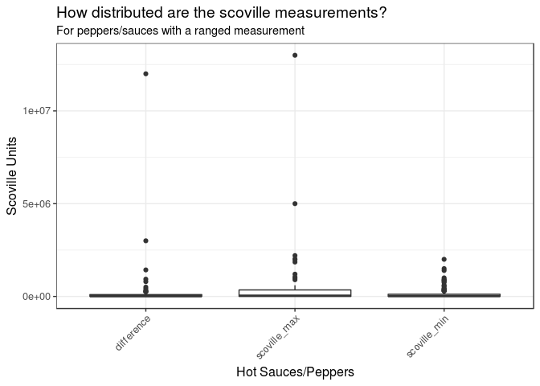
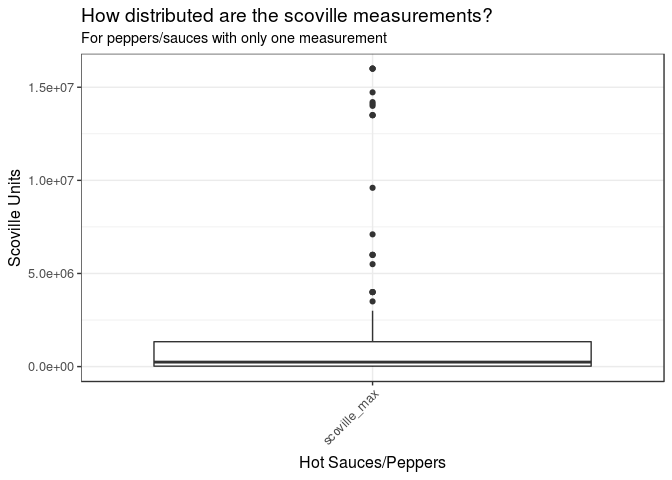
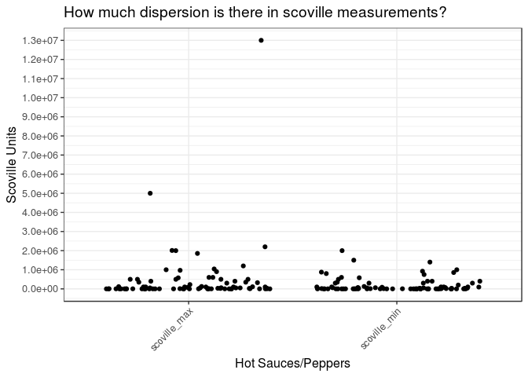
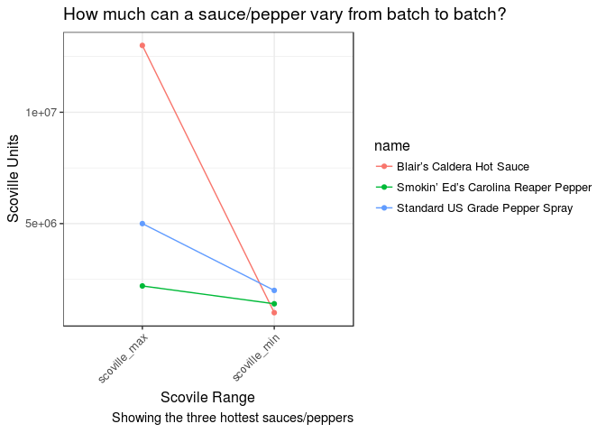
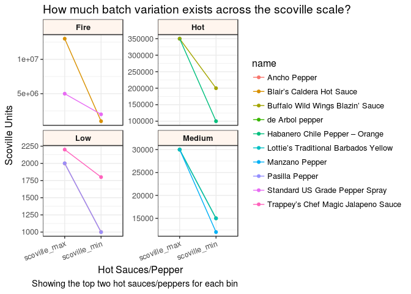
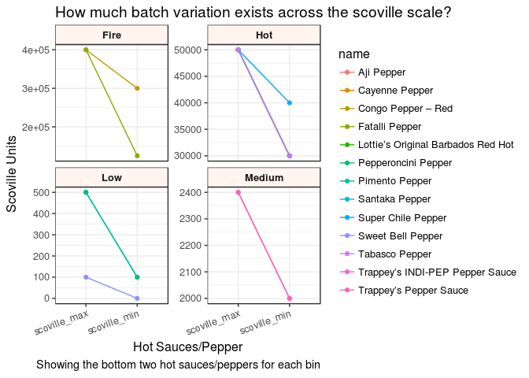

I cannot be the only person who after biting into a jalapeno thougt to myself, "Well if this is hot, I can't even imagine what a ghost pepper might be like"? One way to estimate the different heats of hot peppers and sauces is through the scoville scale. 
"The Scoville scale is a measurement of the pungency (spicy heat) of chili peppers, or other spicy foods, as reported in Scoville heat units (SHU), a function of capsaicin concentration. Capsaicin is one of many related pungent compounds found in chili peppers, collectively called capsaicinoids. The scale is named after its creator, American pharmacist Wilbur Scoville whose 1912 method is known as the Scoville organoleptic test.

In modern times, high-performance liquid chromatography is used to determine the pungency. The older method is a subjective measurement dependent on the capsaicin sensitivity of testers, and so is not a precise or accurate method to measure capsaicinoid concentration." (Wikipedia)


I want to know how comparable different amounts of 'heat' are based on the scoville scale. In the last year or so, I have been watching a youtube series called 'Hot Ones'. In this series, the host sits down with celebrities and asks them questions as the eat progressively hotter and hotter wings. On one episode, Padma Lakshmi known for hosting Bravo's 'Top Chef', claimed that the scoville scale doesn't mean anything because the scale of comparison is too wide. I want to dig in deeper to that claim. 

To do this analysis, I scraped the data collected by Scott Roberts available [here](http://www.scottrobertsweb.com/scoville-scale/). 

This table has five columns:

1. name: the name of the hot sauce

2. scoville_min: the minimum and maximum scovilles of the hot sauce

3. scoville_max: the minimum and maximum scovilles of the hot sauce

4. jalapeno_comp: the heat compared to a jalapenoe

5. difference: the difference between the minimum and maximum scoville, if there is a range


```r
library('tidyverse')
library('knitr')
source('~/scripts/theme_kirsten.R')

opts_chunk$set(message=FALSE, results="hide", warning=FALSE)


table <- read_csv('scoville.csv') %>%
  separate(scoville, into = c('scoville_min', 'scoville_max'), sep = "_") %>%
  mutate_at(vars('scoville_min', "scoville_max"), funs(as.numeric)) %>%
  mutate(difference = ifelse(scoville_min != scoville_max, yes = scoville_max - scoville_min, no = 0)) %>%
  mutate(range = ifelse(scoville_min != scoville_max, yes = TRUE, no = FALSE))

glimpse(table) ## look at the table
```

```
## Observations: 220
## Variables: 6
## $ name          <chr> "Blair’s 16 Million Reserve", "Blair’s 6 A.M.", ...
## $ scoville_min  <dbl> 16000000, 16000000, 16000000, 14725000, 14200000...
## $ scoville_max  <dbl> 16000000, 16000000, 16000000, 14725000, 14200000...
## $ jalapeno_comp <dbl> 3200, 3200, 3200, 2945, 2840, 2820, 2800, 2700, ...
## $ difference    <dbl> 0.0e+00, 0.0e+00, 0.0e+00, 0.0e+00, 0.0e+00, 0.0...
## $ range         <lgl> FALSE, FALSE, FALSE, FALSE, FALSE, FALSE, FALSE,...
```

```r
table(table$range) ## how many of our measurements are in ranges?
```

```
## 
## FALSE  TRUE 
##   134    86
```


<!--html_preserve--><div id="htmlwidget-ef44f5668d6cd4a772aa" style="width:100%;height:auto;" class="datatables html-widget"></div>
<script type="application/json" data-for="htmlwidget-ef44f5668d6cd4a772aa">{"x":{"filter":"none","extensions":["Buttons","FixedHeader","Scroller"],"data":[["1","2","3","4","5","6","7","8","9","10","11","12","13","14","15","16","17","18","19","20","21","22","23","24","25","26","27","28","29","30","31","32","33","34","35","36","37","38","39","40","41","42","43","44","45","46","47","48","49","50","51","52","53","54","55","56","57","58","59","60","61","62","63","64","65","66","67","68","69","70","71","72","73","74","75","76","77","78","79","80","81","82","83","84","85","86","87","88","89","90","91","92","93","94","95","96","97","98","99","100","101","102","103","104","105","106","107","108","109","110","111","112","113","114","115","116","117","118","119","120","121","122","123","124","125","126","127","128","129","130","131","132","133","134","135","136","137","138","139","140","141","142","143","144","145","146","147","148","149","150","151","152","153","154","155","156","157","158","159","160","161","162","163","164","165","166","167","168","169","170","171","172","173","174","175","176","177","178","179","180","181","182","183","184","185","186","187","188","189","190","191","192","193","194","195","196","197","198","199","200","201","202","203","204","205","206","207","208","209","210","211","212","213","214","215","216","217","218","219","220"],["Blair’s 16 Million Reserve","Blair’s 6 A.M.","Blair’s 2009 Halloween Reserve","Blair’s 2005 Holiday Reserve","Meaty Vegan’s Experiment 1064","Blair’s 2004 Holiday Reserve","Blair’s 2006 Holiday Reserve","Blair’s 2005 Halloween Reserve","Blair’s 2007 Halloween Reserve","Blair’s 2006 Halloween Reserve","Blair’s Caldera Hot Sauce","Texas Creek Pure Evil 9.6mil Capsaicin Drops","The Source","Crazy Uncle Jester’s The Jester","Bumblefoot’s Bumblef**kd","CaJohns Get Bitten Black Mamba 6 Hot Sauce","Blair’s 5 A.M.","Standard US Grade Pepper Spray","Blair’s 4 A.M.","CaJohns Magma 4 Hot Sauce","CaJohns Z…Nothing Beyond","Mad Dog 44 Magnum Pepper Extract","Pepper Palace The Hottest Sauce in the Universe","CaJohns Mongoose Hot Sauce","CaJohns Black Mamba Hot Sauce","Smokin’ Ed’s Carolina Reaper Pepper","Trinidad Moruga Scorpion","CaJohns Wanza’s Wicked Temptation Hot Sauce","CaJohns Vicious Viper","Demon Ichor","7-Pot Douglah","Texas Creek Pure Evil Capsaicin Drops","Blair’s 3 A.M. Extract","Da’ Bomb – The Final Answer","Smack My Ass and Call Me Sally – Chet’s Gone Mad","Pyro Diablo","Trinidad 7 Pot Primo","Trinidad Scorpion (Butch T strain)","Blair’s Le Million Reserve","Naga Viper","Crazy Uncle Jester’s Spontaneous Combustion","Trinidad 7 Pot Jonah","Crazy Uncle Jester’s Select Reserve","Gibralta / Spanish Naga Chili Pepper","Infinity Chilli","Bhut Jolokia Pepper / Ghost Chile Pepper","One Million Scoville Pepper Extract","Mad Dog’s Revenge – Little Bottle, Big Big Bite!","Cool Million – One Million Scoville Units","CaJohns Magma Hot Sauce","Gold Cap","Frostbite","Hell’s Inferno Naga Bhut Jolokia Sauce","Pepper Palace The Hottest Sauce in the World","Dorset Naga Pepper","Blair’s 2 A.M. Extract","Trinidad 7 Pot CARDI Strain","Satan’s Blood Chile Extract","Blair’s Ultra Death Sauce","Unbearable","Habanera 750","Blair’s Jersey Death Sauce","Smack My Ass and Call Me Sally – The Slap Heard Around the World","Dave’s Ghost Pepper Naga Jolokia Hot Sauce","Mad Dog 357 Collector’s Edition Hot Sauce","The Hottest Fuckin’ Sauce","Trinidad Yellow Scorpion","Red Savina Habanero Pepper","Melinda’s Red Savina Pepper Sauce","Blair’s Mega Death Sauce","Pure Cap – Capsaicin Extract","Dave’s Private Reserve Insanity Hot Sauce","Spontaneous Combustion Powder","Quaker Steak and Lube Triple Atomic Sauce","Devil’s Tongue – Chocolate","Devil’s Tongue – Red","Congo Pepper – Black","Jamaican Hot Pepper – Chocolate","Habanero Chile Pepper – Chocolate","Trinidad Yellow 7 Pot","Devil’s Tongue – Yellow","Congo Pepper – Red","Mad Dog 357 Hot Sauce","Habanero Chile Pepper – Orange","Buffalo Wild Wings Blazin’ Sauce","Scotch Bonnet Pepper","Danny Cash’s Jolokial Havoc","Congo Pepper – Yellow","Blair’s Possible Side Effects Hot Sauce","Dave’s Ultimate Insanity Hot Sauce","Lethal Ingestion Hot Sauce","Da’ Bomb Ground Zero Hot Sauce","Birds Eye Pepper","Not Cool Chocolate Habanero","Madame Jeanette","Jamaican Hot Pepper – Red","Dave’s Insanity Sauce","Predator Great White Shark","Habanero Punch T.K.O. Hot Sauce","Mad Dog Inferno Hot Sauce – 1999 Reserve Edition","Quaker Steak &amp; Lube Atomic Wing Sauce","Jolokia 10 Hot Sauce","Carolina Cayenne Pepper","Crazy Jerry’s Mustard Gas Hot Sauce","Fatalli Pepper","Da’ Bomb Beyond Insanity Hot Sauce","Tabiche Pepper","Bahamian Pepper","Blair’s Sudden Death Sauce","Thai Pepper","Dead Heat Limited Edition Hot Sauce","Chiltepin pepper","Datil Pepper","Jamaican Hot Pepper – Yellow","Blair’s Beyond Death Hot Sauce","Mad Dog Inferno Hot Sauce","Widow Hot Sauce","You Can’t Handle This Hot Sauce","Chile-Today Red Amazon Powder","Pico de Pajaro Pepper","Charleston Hot Pepper","TorchBearer #42 Slaughter Sauce","Malagueta Pepper","China Express Pepper","Diablo Grande Pepper","Piquin Pepper","Dave’s Temporary Insanity Hot Sauce","Super Chile Pepper","Cayenne Pepper","Aji Pepper","Santaka Pepper","Blair’s After Death Sauce with Chipotle","Lottie’s Original Barbados Red Hot","Tabasco Pepper","Tien Tsin Pepper","Blair’s After Death Sauce","Dead Heat Hot Sauce","TorchBearer #37 Tarnation Sauce","Blair’s Pure Death Sauce","Endorphin Rush Beyond Hot Sauce","Endorphin Rush Hot Sauce","Blair’s Original Death Sauce","Manzano Pepper","de Arbol pepper","Lottie’s Traditional Barbados Yellow","Quaker Steak &amp; Lube SuperCharged Wing Sauce","Serrano Pepper","Chungyang Red Pepper","Naga Sabi Bomb Hot Sauce","Mad Anthony’s Hot Sauce","Big Daddy Jake’s Texas Pit Smoked Hot Sauce","Pain 100% Hot Sauce","El Yucateco XXXtra Hot Habanero (Salsa Kutbil-Ik)","Crazy Jerry’s Brain Damage Hot Sauce","Aleppo Pepper","Wax Pepper","Chipotle Pepper","Orange Krush Habanero Hot Sauce","El Yucateco Green Chile Habanero","Tabasco Habanero Sauce","Crazy Mother Pucker’s Liquid Lava Sauce","Scorned Woman Hot Sauce","El Yucateco Red Chile Habanero","El Yucateco Caribbean Habanero","Jalapeño Pepper","Guajillo Pepper","Quaker Steak &amp; Lube Buckeye BBQ Wing Sauce","Crystal Hot Sauce","Quaker Steak &amp; Lube Cajun Sauce","Tapatio Hot Sauce","El Yucateco Chipotle Hot Sauce","Quaker Steak &amp; Lube Hot Sauce","Sandia Pepper","Rocotillo Pepper","Tabasco Original Hot Sauce","Tabasco Chipotle Sauce","Cascabel Pepper","Cherry Pepper","Fresno Pepper","Anaheim Pepper","Trappey’s INDI-PEP Pepper Sauce","Trappey’s Pepper Sauce","Huy Fong Foods Sriracha Sauce, AKA “Rooster Sauce”","Trappey’s Chef Magic Jalapeno Sauce","Valentina Hot Sauce – Black Label","Frank’s RedHot Xtra Hot Sauce","Ancho Pepper","Pasilla Pepper","Tabasco Garlic Sauce","Trappey’s MEXI-PEP Louisiana Hot Sauce","Trappey’s Bull Brand Louisiana Hot Sauce","Trappey’s Louisiana Hot Sauce","Poblano Pepper","Espanola Pepper","Mirasol Pepper","Del Taco Del Inferno Sauce","El Yucateco Jalapeno Hot Sauce","Tabasco Green Sauce","Trappey’s Red Devil Cayenne Pepper Sauce","Peppadew Pepper","Coronado Pepper","New Mexico Pepper","Cholula Hot Sauce","Valentina Hot Sauce – Red","Taco Bell Lava Sauce","Texas Pete’s Hot Sauce","Ott’s Wing Sauce","Santa Fe Grande Pepper","Bee Sting Honey N’ Habanero Hot Sauce","Tabasco SWEET &amp; Spicy Pepper Sauce","Pimento Pepper","Pepperoncini Pepper","Taco Bell Fire Sauce","Frank’s Red Hot","Original Louisiana Hot Sauce","Iguana Cayenne Red Pepper Sauce","Mexi-Bell Pepper","NuMex Big Jim Pepper","Cubanelle Pepper","Sweet Bell Pepper"],[16000000,16000000,16000000,14725000,14200000,14100000,14000000,13500000,13500000,13500000,1000000,9600000,7100000,6000000,6000000,6000000,5500000,2000000,4000000,4000000,4000000,4000000,3500000,3000000,2500000,1400000,580198,2000000,2000000,2000000,923589,1560000,1500000,1500000,1500000,1500000,1469000,1463700,1400000,1382118,1200000,800000,1100000,1086844,1067286,855000,1000000,1000000,1000000,1000000,1000000,1000000,1000000,1000000,876000,600000,850000,800000,800000,750000,750000,750000,700000,650000,600000,600000,400000,350000,577000,550000,500000,500000,400000,500000,500000,400000,300000,300000,300000,500000,400000,300000,357000,100000,200000,100000,305500,300000,283000,250000,234500,234000,100000,225000,225000,200000,180000,175000,162300,150000,150000,134000,100000,125000,125000,119700,85000,95000,105000,50000,100000,50000,100000,100000,99760,90000,90000,80000,75000,70000,70000,67582,60000,60000,60000,40000,57000,40000,30000,30000,30000,50000,30000,30000,50000,49250,42000,38202,35000,33390,33390,30000,12000,15000,15000,30000,10000,10000,21540,20000,14000,13650,11600,11000,10000,5000,5000,9450,8910,7000,6240,5940,5790,5400,2500,2500,5000,2000,3870,3000,3400,3000,1500,1500,2500,1500,1000,1000,2500,500,2000,2000,2200,1800,2100,2085,1000,1000,1200,1400,1200,1200,1000,1000,1500,1500,1270,600,800,1177,700,500,500,900,800,747,727,500,670,100,100,100,500,450,450,430,100,100,100,0],[16000000,16000000,16000000,14725000,14200000,14100000,14000000,13500000,13500000,13500000,13000000,9600000,7100000,6000000,6000000,6000000,5500000,5000000,4000000,4000000,4000000,4000000,3500000,3000000,2500000,2200000,2009231,2000000,2000000,2000000,1853936,1560000,2000000,1500000,1500000,1500000,1469000,1463700,1400000,1382118,1200000,1200000,1100000,1086844,1067286,1041427,1000000,1000000,1000000,1000000,1000000,1000000,1000000,1000000,970000,900000,850000,800000,800000,750000,750000,1000000,700000,650000,600000,600000,600000,577000,577000,550000,500000,500000,500000,500000,500000,500000,500000,500000,500000,600000,400000,400000,357000,350000,350000,325000,305500,300000,283000,250000,234500,234000,225000,225000,225000,200000,180000,175000,162300,150000,150000,134000,125000,125000,400000,119700,115000,110000,105000,100000,100000,100000,300000,100000,99760,90000,90000,80000,75000,100000,100000,67582,60000,100000,100000,58000,57000,50000,50000,50000,50000,50000,50000,50000,75000,49250,42000,38202,35000,33390,33390,30000,30000,30000,30000,30000,23000,23000,21540,20000,14000,13650,11600,11000,10000,10000,10000,9450,8910,8000,6240,5940,5790,5400,8000,5000,5000,4000,3870,3000,3400,3000,2500,2500,2500,2500,2500,2500,10000,2500,2400,2400,2200,2200,2100,2085,2000,2000,1800,1800,1600,1600,1500,1500,2500,1500,1270,1200,1200,1177,1000,1000,1000,900,800,747,727,700,670,600,500,500,500,450,450,430,1000,1000,1000,100],[3200,3200,3200,2945,2840,2820,2800,2700,2700,2700,2600,1920,1420,1200,1200,1200,1100,1000,800,800,800,800,700,600,500,440,401.8,400,400,400,370.79,312,300,300,300,300,293.8,292.74,280,276.42,240,240,220,217.37,213.46,208.29,200,200,200,200,200,200,200,200,194,180,170,160,160,150,150,150,140,130,120,120,120,115.4,115.4,110,100,100,100,100,100,100,100,100,100,100,80,80,71.4,70,70,65,61.1,60,56.6,50,46.9,46.8,45,45,45,40,36,35,32.46,30,30,26.8,25,25,25,23.94,23,22,21,20,20,20,20,20,19.95,18,18,16,15,14,14,13.52,12,12,12,11.6,11.4,10,10,10,10,10,10,10,10,9.85,8.4,7.64,7,6.68,6.68,6,6,6,6,6,4.6,4.6,4.31,4,2.8,2.73,2.32,2.2,2.1,2,2,1.89,1.78,1.6,1.25,1.19,1.16,1.08,0,0,0,0.8,0.77,0.72,0.68,0.6,0.5,0.5,0.5,0.5,0.5,0.5,0.5,0.5,0.48,0.48,0.44,0.44,0.42,0.42,0.4,0.4,0.36,0.36,0.32,0.32,0.3,0.3,0.3,0.3,0.25,0.24,0.24,0.24,0.2,0.2,0.2,0.18,0.16,0.15,0.15,0.14,0.13,0.12,0.1,0.1,0.1,0.9,0.9,0.9,0.2,0.2,0.2,0.1],[0,0,0,0,0,0,0,0,0,0,12000000,0,0,0,0,0,0,3000000,0,0,0,0,0,0,0,800000,1429033,0,0,0,930347,0,500000,0,0,0,0,0,0,0,0,400000,0,0,0,186427,0,0,0,0,0,0,0,0,94000,300000,0,0,0,0,0,250000,0,0,0,0,200000,227000,0,0,0,0,100000,0,0,100000,200000,200000,200000,100000,0,100000,0,250000,150000,225000,0,0,0,0,0,0,125000,0,0,0,0,0,0,0,0,0,25000,0,275000,0,30000,15000,0,50000,0,50000,200000,0,0,0,0,0,0,30000,30000,0,0,40000,40000,18000,0,10000,20000,20000,20000,0,20000,20000,25000,0,0,0,0,0,0,0,18000,15000,15000,0,13000,13000,0,0,0,0,0,0,0,5000,5000,0,0,1000,0,0,0,0,5500,2500,0,2000,0,0,0,0,1000,1000,0,1000,1500,1500,7500,2000,400,400,0,400,0,0,1000,1000,600,400,400,400,500,500,1000,0,0,600,400,0,300,500,500,0,0,0,0,200,0,500,400,400,0,0,0,0,900,900,900,100],[false,false,false,false,false,false,false,false,false,false,true,false,false,false,false,false,false,true,false,false,false,false,false,false,false,true,true,false,false,false,true,false,true,false,false,false,false,false,false,false,false,true,false,false,false,true,false,false,false,false,false,false,false,false,true,true,false,false,false,false,false,true,false,false,false,false,true,true,false,false,false,false,true,false,false,true,true,true,true,true,false,true,false,true,true,true,false,false,false,false,false,false,true,false,false,false,false,false,false,false,false,false,true,false,true,false,true,true,false,true,false,true,true,false,false,false,false,false,false,true,true,false,false,true,true,true,false,true,true,true,true,false,true,true,true,false,false,false,false,false,false,false,true,true,true,false,true,true,false,false,false,false,false,false,false,true,true,false,false,true,false,false,false,false,true,true,false,true,false,false,false,false,true,true,false,true,true,true,true,true,true,true,false,true,false,false,true,true,true,true,true,true,true,true,true,false,false,true,true,false,true,true,true,false,false,false,false,true,false,true,true,true,false,false,false,false,true,true,true,true]],"container":"<table class=\"display\">\n  <thead>\n    <tr>\n      <th> <\/th>\n      <th>name<\/th>\n      <th>scoville_min<\/th>\n      <th>scoville_max<\/th>\n      <th>jalapeno_comp<\/th>\n      <th>difference<\/th>\n      <th>range<\/th>\n    <\/tr>\n  <\/thead>\n<\/table>","options":{"dom":"frtBip","buttons":["copy","csv","excel","pdf","print"],"deferRender":true,"scrollY":200,"scroller":true,"columnDefs":[{"className":"dt-right","targets":[2,3,4,5]},{"orderable":false,"targets":0}],"order":[],"autoWidth":false,"orderClasses":false}},"evals":[],"jsHooks":[]}</script><!--/html_preserve-->


I first want to view the distribution of the values of scoville that have a range of values. 


```r
box <- table %>%
  filter(range == TRUE) %>%
  select(scoville_max, scoville_min, difference, name) %>%
  gather(key = scoville_data, value = value, -name) %>%
  ggplot(aes(y = value, x = scoville_data)) 
box <- box + geom_boxplot()
box <- box + theme_kirsten() + labs(title = 'How distributed are the scoville measurements?',
                                    subtitle = 'For peppers/sauces with a ranged measurement',
                                    y = 'Scoville Units', x = 'Hot Sauces/Peppers')

box
```

<!-- -->


We see some huge differences for what can be considered the 'minimum' and 'maximum' scoville unit for hot sauces that vary in their heat. 


```r
box <- table %>%
  filter(range == FALSE) %>%
  select(scoville_max, name) %>%
  gather(key = scoville_data, value = value, -name) %>%
  ggplot(aes(y = value, x = scoville_data)) 
box <- box + geom_boxplot() 
box <- box + theme_kirsten() + labs(title = 'How distributed are the scoville measurements?',
                                    subtitle = 'For peppers/sauces with only one measurement',
                                    y = 'Scoville Units', x = 'Hot Sauces/Peppers')

box
```

<!-- -->


While some of the hot sauces that don't have ranges still have a similar order of maximum heat as the ranged hot sauces. 


By looking at the individual points, we can see a lot of dispersion in the maximal values, and less for the minimals.


```r
table %>%
  filter(range == TRUE) %>%
  select(scoville_max, scoville_min, name) %>%
  gather(key = scoville_data, value = value, -name) %>%
  ggplot(aes(y = value, x = scoville_data)) +
  geom_jitter() + 
  theme_kirsten() + 
  labs(title = 'How much dispersion is there in scoville measurements?', y = 'Scoville Units', x = 'Hot Sauces/Peppers') +
  scale_y_continuous(breaks = seq(0, 16000000, by = 1000000))
```

<!-- -->


```r
## lets look at the top three variables

table %>%
  filter(range == TRUE) %>%
  select(scoville_max, scoville_min, name) %>%
  top_n(n = 3, wt = scoville_max) %>%
  gather(key = scoville_data, value = value, -name) %>%
  ggplot(aes(y = value, x = scoville_data, colour = name, group = name)) +
  geom_point() +
  geom_path() +
  theme_kirsten() +
  labs(title = 'How much can a sauce/pepper vary from batch to batch?',
       caption = 'Showing the three hottest sauces/peppers',
       y = 'Scoville Units', x = 'Scovile Range')
```

<!-- -->


Blair's Caldera Hot Sauce can potentially vary by an order of magnitude between batches of sauce, with the low end being less hot than pepper spray. Yikes!


Next I'm going to make the previous plot for arbitrary bins of the data, based on the ranked maximum scoville unit. 


```r
bin_key <- data.frame(bins = c(1,2,3,4),
                      bin_name = c('Low', 'Medium', 'Hot', 'Fire'),
                      stringsAsFactors = FALSE
)

table %>%
  filter(range == TRUE) %>%
  mutate(bins = ntile(rank(scoville_max), 4)) %>%
  group_by(bins) %>%
  top_n(n = 2, wt = scoville_max) %>%
  select(scoville_max, scoville_min, name, bins) %>%
  gather(key = scoville_data, value = value, -name, -bins) %>%
  left_join(., bin_key, by = 'bins') %>%
  ggplot(aes(y = value, x = scoville_data, group = name, colour = name)) +
  geom_point() +
  geom_line() +
  theme_kirsten(angle = 20) + 
  labs(title = 'How much batch variation exists across the scoville scale?', 
       y = 'Scoville Units', x = 'Hot Sauces/Pepper', 
       caption = 'Showing the top two hot sauces/peppers for each bin') +
  facet_wrap(~bin_name, scales = 'free_y')
```

<!-- -->


```r
table %>%
  filter(range == TRUE) %>%
  mutate(bins = ntile(rank(scoville_max), 4)) %>%
  group_by(bins) %>%
  top_n(n = -2, wt = scoville_max) %>%
  select(scoville_max, scoville_min, name, bins) %>%
  gather(key = scoville_data, value = value, -name, -bins) %>%
  left_join(., bin_key, by = 'bins') %>%
  ggplot(aes(y = value, x = scoville_data, group = name, colour = name)) +
  geom_point() +
  geom_line() +
  theme_kirsten(angle = 20) + 
  labs(title = 'How much batch variation exists across the scoville scale?', 
       y = 'Scoville Units', x = 'Hot Sauces/Pepper', 
       caption = 'Showing the bottom two hot sauces/peppers for each bin') +
  facet_wrap(~bin_name, scales = 'free_y')
```

<!-- -->


These plots lead me to believe that although the high-performance liquid chromatograpy method for determining the number of scoville units for a given pepper or sauce may be accurate, the ranges of variation seen for the sauces and peppers are probably a result of inconsistencies in pepper growth conditions, or dilutions of the sauce which can both affect the amount of heat in a given sample. 


